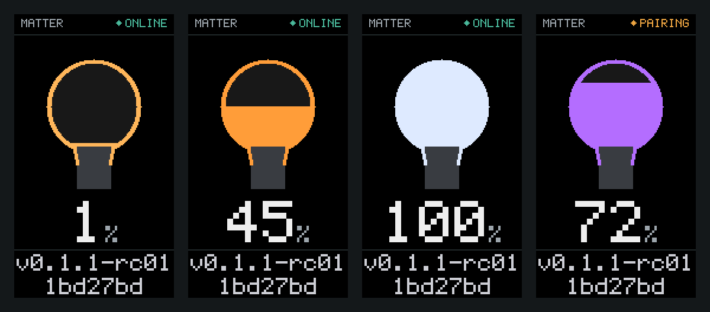

# Matter light for the M5Stack StickS3

A Matter **extended color light** for the M5Stack StickS3 (ESP32-S3-PICO-1-N8R8),
built on [ESP-Matter](https://docs.espressif.com/projects/esp-matter/en/latest/esp32s3/developing.html).
It commissions over BLE, runs over Wi-Fi, and pairs with the Apple Home app.

The StickS3 has no LED, so the light is *drawn* on the on-board 1.14" ST7789P3
LCD: a bulb whose glass fills to the commanded dim level, the level as a
percentage, and the firmware build along the bottom. Colour — hue/saturation,
colour temperature, CIE xy — tints the bulb. On/Off cuts the backlight, so
"off" is a dark panel.



## Hardware

| | |
| --- | --- |
| Board | M5Stack StickS3 (ESP32-S3-PICO-1-N8R8, 8 MB flash, 8 MB PSRAM) |
| Display | 1.14" ST7789P3, 135×240, SPI |
| PMIC | M5PM1 at I²C `0x6E` — gates the LCD rail |
| Buttons | KEY1 (G11) toggles the light, 5 s hold factory resets |

No extra hardware is needed. Wi-Fi and BLE only: the ESP32-S3 has no 802.15.4
radio, so Matter-over-Thread is not an option on this board.

## Layout

| Path | What it is |
| --- | --- |
| `main/app_main.cpp` | Matter node: root node + extended color light endpoint |
| `main/app_driver.cpp` | Maps cluster attributes to the light, KEY1 button handling |
| `components/stick_s3_light/stick_s3_light.c` | Board driver: PMIC rail, ST7789P3 panel, backlight, render task |
| `components/stick_s3_light/face.c` | The picture on the panel. Pure drawing, no hardware |
| `components/stick_s3_light/font5x7.c` | Generated 5×7 ASCII font (see `tools/genfont.py`) |
| `tools/facepreview.c` | Renders the face on a host, so the layout can be checked without flashing |
| `partitions.csv` | Partition table (dual OTA slots) |
| `sdkconfig.defaults` | Matter + StickS3 config (8 MB flash, USB-Serial/JTAG console) |
| `version.txt` | The build number the panel shows |

Board facts this depends on (M5Stack StickS3 PinMap + M5GFX `board_M5StickS3`):

- LCD: MOSI G39, SCK G40, DC G45, CS G41, RST G21, backlight G38; 135×240 with a
  52/40 offset, colour inversion on.
- The LCD rail (L3B) is **not** wired to the SoC — it is gated by GPIO2 of the
  M5PM1 PMIC at I²C address `0x6E` (SDA G47, SCL G48) and needs ~100 ms to settle
  before the panel is initialized.
- Buttons: KEY1 G11, KEY2 G12 (unused), active low.

## The face

The panel is four fixed bands, so a level change only repaints the middle two:

| Band | Y | Contents |
| --- | --- | --- |
| status | 0–17 | `MATTER` and the network state |
| bulb | 18–153 | Glass circle at (67, 78) r 40, neck, screw base. The glass fills from the neck upward |
| level | 154–199 | Percentage at 5× scale |
| footer | 200–240 | Build string, split across two lines at the commit |

Everything is flat spans and a 5×7 bitmap font drawn into a 30-line band buffer.
No graphics library — LVGL would add ~250 kB to an image that has to fit a
1.92 MB OTA slot — and no framebuffer, since a full one is 63 kB and PSRAM is
left disabled.

`esp_lcd_panel_draw_bitmap()` queues the colour transfer and returns while DMA
is still reading the band buffer, so each band waits on `on_color_trans_done`
before the next is drawn over it. Skipping that wait renders fragments of one
band into another.

To see the face without flashing:

```bash
cc -Icomponents/stick_s3_light -o /tmp/facepreview tools/facepreview.c \
   components/stick_s3_light/face.c components/stick_s3_light/font5x7.c -lm
/tmp/facepreview /tmp && python3 tools/ppm2png.py /tmp/face-*.ppm
```

## Build

Requires ESP-IDF **v5.4.1** and esp-matter **v1.4.2**. With both installed at
`~/esp`, each new terminal needs:

```bash
source ~/esp/esp-idf/export.sh && source ~/esp/esp-matter/export.sh && export IDF_CCACHE_ENABLE=1
```

Then, from this directory:

```bash
idf.py set-target esp32s3 && idf.py build
```

`sdkconfig` is generated and git-ignored, so `set-target` is only needed once on
a fresh checkout.

### Build number

The string along the bottom of the panel is `<version>-<rc>-<commit>`, e.g.
`v0.1.1-rc01-d0d002c`. The first two parts come from [version.txt](version.txt);
the short commit is appended by CMake, so it is never typed and never wrong:

```bash
echo v0.1.1-rc02 > version.txt && idf.py build
```

`version.txt`, `.git/HEAD` and the current branch ref are all configure
dependencies, so editing the version or making a commit re-stamps the image
without a clean. Keep the version part to 11 characters or fewer and both
footer lines render at double size.

## Flash

The StickS3 uses the ESP32-S3's native USB-Serial/JTAG, so it enumerates as
`/dev/ttyACM0` when plugged in.

```bash
idf.py -p /dev/ttyACM0 flash monitor
```

Add `erase-flash` before `flash` for a clean slate — note that this wipes NVS,
so the device leaves any Matter fabric it had joined and must be re-paired.

If the board does not enter download mode on its own, hold the front button
while plugging it in.

### Under WSL2

The USB device must be attached to the Linux VM first. Binding is a one-time
step needing an **admin PowerShell**:

```powershell
usbipd list
usbipd bind --busid <BUSID>
```

After that, attaching works from an ordinary shell, and has to be repeated
whenever the device re-enumerates — which it does on every chip reset:

```powershell
usbipd attach --wsl --busid <BUSID>
```

If a flash fails partway with `could not open port`, the board re-enumerated
mid-command. Re-attach and retry. If Windows starts reporting it as
`Unknown USB Device (Device Descriptor Request Failed)`, unplug and replug it.

## Pair with the Apple Home app

The firmware is built with the standard Matter **test** credentials
(vendor `0xFFF1`, product `0x8000`, discriminator 3840, passcode 20202021), so
Home will show an "uncertified accessory" warning — expected for a development
build. Pairing needs a home hub (HomePod or Apple TV) on the same Wi-Fi.

1. Flash and boot the board. The serial monitor prints the onboarding payload.
2. In Home: **+** → *Add Accessory* → *More options…* → **My Accessory Isn't Shown Here**,
   then enter the setup code or scan the QR code.
3. Home commissions over BLE and hands the board your Wi-Fi credentials.

| | |
| --- | --- |
| Manual setup code | `3497-011-2332` |
| QR payload | `MT:Y.K9042C00KA0648G00` |

Render the QR at <https://project-chip.github.io/connectedhomeip/qrcode.html?data=MT%3AY.K9042C00KA0648G00>.

Once paired, the Home tile controls power, brightness and colour, and the panel
follows. KEY1 toggles it locally, and Home reflects the change.

## Reset

- **Factory reset:** hold KEY1 for 5 s, or run `matter esp factoryreset` in the
  serial console. Do this before re-pairing — a commissioned device will not
  accept a second commissioning until the fabric is removed.
- The serial console also has `matter esp wifi` and `matter esp dia` commands.

## Status

Confirmed on hardware:

- PMIC power-up sequence brings the panel to life.
- BLE commissioning into the Apple Home app.
- The bulb face: level changes from Home track the fill and the percentage, and
  the build string renders correctly.

Not yet confirmed on hardware:

- The colour path (hue/saturation, colour temperature, CIE xy) driving the tint.
- KEY1 toggle and the 5 s factory-reset hold.
- Matter OTA. The OTA Requestor is compiled in and the partition table has two
  app slots, but no update has been served to the device. `SoftwareVersion` is
  still `0`, so it would need bumping before an image is accepted.

Known loose end: one episode of the accessory going "No Response" in Home and
recovering on its own, cause not established — the serial log was not captured.
If it recurs, catch `idf.py monitor` output during the outage: a boot banner
means the board reset, no banner means it only lost the network.

The image is ~1.53 MB, leaving 22% free in the 1.92 MB OTA partition.

## Licence

Apache License 2.0 — see [LICENSE](LICENSE). Every source file carries an SPDX
header, so provenance is machine-readable:

- `SPDX-License-Identifier: Apache-2.0` on all sources.
- `main/app_main.cpp`, `main/app_driver.cpp` and `main/app_priv.h` additionally
  note that they derive from the `light` example in
  [esp-matter](https://github.com/espressif/esp-matter), which Espressif placed
  in the public domain (CC0 1.0).
